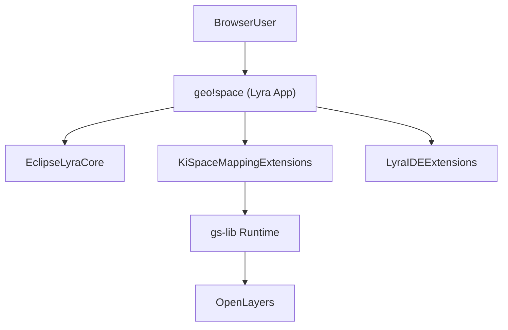

# 🌐 geo!space
[](https://deepwiki.com/erdalkaraca/geospace)
[](#-browser-compatibility)
[](#-key-features)
[](#-quick-start)
[](https://projects.eclipse.org/proposals/eclipse-lyra)

**The Interactive Mapping IDE in Your Browser**

geo!space is a powerful browser-based mapping IDE built as an [Eclipse Lyra](https://projects.eclipse.org/proposals/eclipse-lyra) app. It provides professional mapping capabilities entirely in your browser: create interactive maps, work with geospatial data, and transform maps into cross-platform Progressive Web Apps – all without installing any native software.

## 📑 Table of Contents

- [✨ Key Features](#-key-features)
- [🌐 Browser Compatibility](#-browser-compatibility)
- [🌟 Use Cases](#-use-cases)
- [🚀 Getting Started](#-getting-started)
- [👨‍💻 Development](#-development)
- [💡 Examples](#-examples)
- [🔧 Troubleshooting](#-troubleshooting)
- [❓ FAQ](#-faq)
- [🏗️ Technical Architecture](#️-technical-architecture)
- [🤝 Trusted by](#-trusted-by)
- [⚡ Quick Start](#-quick-start)

## ✨ Key Features

### 🗺️ **Professional Mapping**
- **Interactive Map Editor**: Create and edit maps using the custom `.geospace` format
- **Multiple Data Sources**: Support for OSM, XYZ tiles, GeoJSON, KML, GeoTIFF, GPX, Features, BM (basemap.de), WMS, WMTS, and Overpass API
- **Satellite Imagery**: Built-in access to Esri World Imagery and Sentinel-2 satellite imagery
- **Layer Management**: Vector layers, tile layers, and layer groups with full styling control
- **OpenLayers Integration**: Built on the industry-standard OpenLayers mapping library
- **Advanced Styling**: Dynamic style loading and management system
- **PWA Transformation**: Convert `.geospace` files into cross-platform Progressive Web Apps

### 🛠️ **Map Building & Deployment**
- **PWA Builder**: Transform `.geospace` files into cross-platform Progressive Web Apps
- **Custom Controls**: Create interactive UI components using JavaScript modules
- **Module System**: Import and share custom map controls within your workspace

## 🌟 Use Cases

- **Data Analysts**: Create interactive maps for data visualization
- **Urban Planners**: Design and prototype mapping applications  
- **Developers**: Build geospatial applications without complex setup
- **Researchers**: Prototype location-based applications quickly
- **Educators**: Teach mapping and geospatial concepts interactively
- **App Creators**: Transform maps into cross-platform PWAs for mobile, desktop, and web deployment

## 🚀 Getting Started

### 1. **Connect a Workspace**
- In the Workspace tab, click the folder icon "Load workspace folder"
- Choose a local folder to use as your workspace
- This folder will be saved and restored when you reload geo!space

### 2. **Working with Files**
- **`.geospace` files**: Map files that open in the interactive map editor
- **Other files**: Open in the appropriate editor based on file type

### 3. **Creating Interactive Maps**
- Double-click `.geospace` files to open them in the map editor
- Use the map editor's UI to interact with layers, features, and styling
- Add data sources: OSM tiles, GeoJSON files, KML, GeoTIFF, GPX, or custom features
- **Build PWA**: Use the "Build map" button to transform your `.geospace` file into a cross-platform Progressive Web App

### 4. **Resource Catalog**
- Browse the catalog view for curated maps, datasets, icons, and controls
- Select items from catalog categories (datasets, maps, overlays, controls, icons)
- Use the "Checkout" button to download items directly to your workspace
- Access pre-built basemaps (OpenStreetMap, basemap.de) and sample datasets

## 👨‍💻 Development

geo!space runs as an Eclipse Lyra app and provides a powerful development environment for creating custom map controls, overlays, and workflows.

### **Run locally (for developers)**

To work on geo!space itself:

1. **Install dependencies**
   - At the repository root:
     - `npm install`
2. **Start the dev server**
   - From the root:
     - `npm run dev`
   - This runs the Lyra-based app from the `@kispace-io/app` workspace (served by Vite) and mounts it into the `#app-root` element in `index.html`.
3. **Build and preview**
   - Build: `npm run build`
   - Preview: `npm run preview`

The main app definition lives in `packages/app/src/geospace-app.ts`, where the Eclipse Lyra `AppDefinition` is registered along with all geo!space-specific extensions.

### **Custom Modules**

Create interactive UI components for your maps using JavaScript modules. geo!space uses **Lit** for templating and **Web Awesome** for UI components - both are provided by default and based on browser standards only, so no build tools are required.

**Key Features:**
- **No Build Tools**: Write plain JavaScript modules that run directly in the browser
- **Lit Templating**: Use Lit's HTML template literals for reactive UI
- **Web Awesome Components**: Access to a full library of web-standard UI components
- **OpenLayers API**: Full access to OpenLayers through the `ol` namespace object
- **Module System**: Import and share modules within your workspace using relative paths or bare specifiers

**Getting Started:**
1. Create a JavaScript file in your workspace (e.g., `my-control.js`)
2. Export a default function that receives APIs via destructuring
3. Return a Lit template from your function
4. Add your module to a map's `controls` or `overlays` array in the `.geospace` file

**Example:**
```javascript
export default function ({html, style, events, map}) {
    style({
        position: "absolute",
        bottom: "0",
        left: "0",
        right: "0"
    });

    return () => html`
        <div style="display: grid; grid-template-columns: 1fr 1fr 1fr;">
            <wa-button @click=${() => events("drawer/openMenu")}>
                Menu
            </wa-button>
        </div>
    `;
}
```

**Learn More:**
- 📖 See the [User Modules Guide](packages/app/public/docs/user-modules.md) for complete documentation
- 🎨 Browse Web Awesome components: https://webawesome.com
- 🗺️ Explore OpenLayers API: https://openlayers.org/

## 💡 Examples

### **Create a City Map**
```
1. Create a new .geospace file
2. Add OpenStreetMap as base layer
3. Add GeoJSON layers for buildings and trees
4. Use the "Build map" button to create a deployable PWA
```

### **Custom Map Controls**
```
1. Create a JavaScript module for custom map controls
2. Use Lit and WebAwesome components for UI
3. Add your module to a map's controls array
4. Build the map as a PWA for deployment
```

## 🔧 Troubleshooting

### **Common Issues**

**File Not Found**
- If you don't see expected files, try reloading the workspace
- Ensure the workspace folder is properly connected

**Browser Compatibility Issues**
- Use Chrome or Opera for full functionality
- Firefox and Safari have limited File System Access API support

**Map Not Loading**
- Check that `.geospace` files contain valid JSON
- Verify data source URLs are accessible
- Ensure required resources (icons, styles) are available

## ❓ FAQ

**Q: Do I need to install anything?**
A: No! geo!space runs entirely in your browser. Just open it in Chrome or Opera.

**Q: Is my data secure?**
A: Yes. All data stays in your browser and local workspace. No data is sent to external servers.

**Q: Can I use geo!space offline?**
A: Yes, for basic mapping features. Some features may require internet connection for data sources.

**Q: How do I share my maps?**
A: Use the "Build map" button to create a PWA that can be deployed anywhere or shared as a standalone app.

**Q: What file formats are supported?**
A: Maps: `.geospace` (JSON), Data: GeoJSON, KML, GPX, GeoTIFF, Features. Tile sources: OSM, XYZ, WMS, WMTS, BM (basemap.de), Satellite imagery (Esri, Sentinel-2).

**Q: Can I customize maps?**
A: Yes! Create custom controls using JavaScript modules with Lit and WebAwesome components.

## 🏗️ Technical Architecture

geo!space is implemented as an [Eclipse Lyra](https://projects.eclipse.org/proposals/eclipse-lyra) app that uses Lyra's core IDE infrastructure and extension system.

At startup, the Lyra `AppDefinition` in `packages/app/src/geospace-app.ts` is registered and auto-started into the `#app-root` container. The built-in "Welcome" command opens this `README.md` inside Lyra's editor system as the in-app welcome page.

**geo!space-Specific Stack:**
- **Eclipse Lyra Core**: Application shell, workspace, command palette, editor registry, AI system, and utilities (`@eclipse-lyra/core` and Lyra extensions)
- **Mapping Extensions**: geo!space-specific Lyra extensions such as:
  - `@kispace-io/extension-map-editor`
  - `@kispace-io/extension-mapbuilder`
  - `@kispace-io/extension-mapprops`
  - `@kispace-io/extension-style-editor`
  - `@kispace-io/extension-overpass`
  - `@kispace-io/extension-gtfs`
- **IDE Extensions**: Additional Lyra extensions for markdown editing, Monaco code editing, media viewing, settings, memory usage, AI assistance, data viewing, and more
- **OpenLayers**: Professional mapping library used for rendering and interaction
- **Custom Runtime (`gs-lib`)**: Map-to-OpenLayers conversion system and runtime utilities
- **Style Loader**: Dynamic style loading for geospatial data
- **PWA Builder**: Transform `.geospace` files into cross-platform Progressive Web Apps
- **Lit & WebAwesome**: Available for creating custom map controls and overlays



## 🤝 Trusted by

- **[Kiosk Scout](https://finder.kioskscout.de)**: A cross-platform PWA for finding nearby vending machines
- **Want your geo!space app listed here?** Contact us!

---

## ⚡ Quick Start

**Get up and running in 3 minutes:**

1. **Open geo!space** in Chrome or Opera
2. **Connect workspace** - Click folder icon and select a local directory
3. **Create your first map** - Create a new `.geospace` file or open existing files
4. **Add data layers** - Import GeoJSON, KML, or add tile sources
5. **Build your app** - Use the "Build map" button to create a deployable PWA

### **First-Time Setup**
- **Start mapping immediately** - No configuration required
- **Add data sources** - Import your geospatial data or use built-in tile sources
- **Customize maps** - Create custom controls using JavaScript modules

## 🎯 Ready to Start?

1. **Load the app** in Chrome or Opera
2. **Connect a workspace** folder
3. **Create your first map** or open an existing `.geospace` file
4. **Add layers and customize** your map
5. **Build and share** your interactive maps as PWAs

**Happy mapping! 🗺️✨**